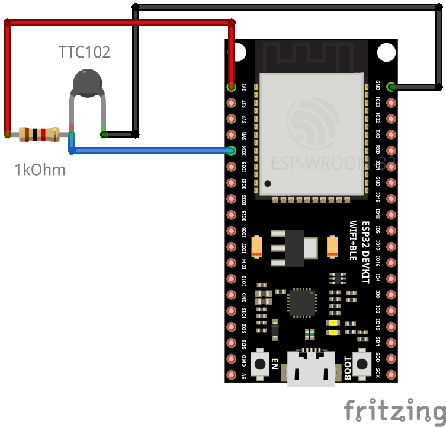
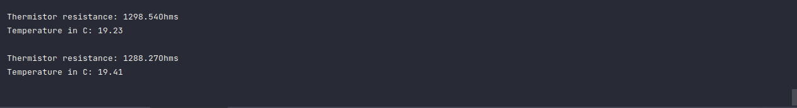
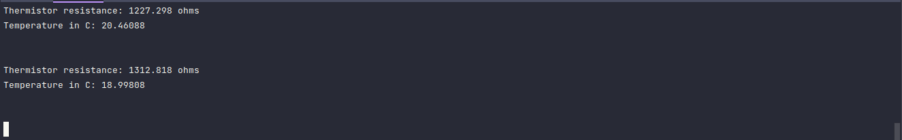

# Thermistor

Thermistors are variable resitors that change their resistance with temperature.

There are two class:
- Negative Temperature Coefficient(NTC): temperature increase => resistance decrease
- Positive Temperature Coefficient(PTC): temperature increase => resisitance increase

## Components
Components used in this project are:
- TTC102 (NTC thermistor)
- 1kOhm resistor
- ESP32

## Circuit Diagram


## Steps
1. TTC102 is NTC thermistor. According to data sheet, first two number means value and last number represent power of that value. So, TTC102 means 1000Ohm resistor.

2. Choose the resistor which have same resistance value.

3. The resistor is used as the voltage divider to measure the resistance of the thermistor.
	$Vo = \frac{R}{R+1K} \times Vcc$

4. The ADC value of the thermistor can be read in ESP32.Since ESP32 has 12 bit resolution, the value range between 0 to 4096 for 0 to 3.3V.
	$ADC value = 4096 \times \frac{Vo}{Vcc}$

5. Resistance of TTC102 can be calculated using the following formula.
	$R = Ro(1K) \times (\frac{4096}{Vo} - 1)$

6. The temperature of the thermistor can be calculated using the Steinhart-Hart Equation. Kelvin value is used for temperature in this equation. B is the coefficient of the thermistor. 3950 is common value for B.
	$\frac{1}{T} = \frac{1}{To} + \frac{1}{B} log(\frac{R}{Ro(1K)}$

## Code

### Code in Arduino
```cpp
#include <Arduino.h>

const int thermistor_pin = 34;
const int r1 = 1000.0;

double steinhartTemperatureC(double r, double r0=1000.0, double t0=25.0, double beta=3950.0){
    double steinhart;
    steinhart = log(r / r0) / beta;
    steinhart += 1.0 / (t0 + 273.15);
    steinhart = (1.0 / steinhart) - 273.15;
    return steinhart;
}

void setup() {
    Serial.begin(115200);

    pinMode(thermistor_pin, INPUT);
}

void loop() {
    int v0 = analogRead(thermistor_pin);
    double r2 = r1 * (4096.0 / v0 - 1.0);
    Serial.print("Thermistor resistance: ");
    Serial.print(r2);
    Serial.println("Ohms");

    double temperature_c = steinhartTemperatureC(r2);
    Serial.print("Temperature in C: ");
    Serial.println(temperature_c);

    Serial.println();
    delay(1000);
}
```
Screen shot


### Code in Micropython
```python
import math
from machine import Pin, ADC
from time import sleep

thermistor_pin = 34
r1 = 1000.0


def steinhart_temperature_c(r, r0=1000, t0=25.0, beta=3950.0):
    steinhart = math.log(r / r0) / beta
    steinhart += 1.0 / (t0 + 273.15)
    steinhart = (1.0 / steinhart) - 273.15
    return steinhart


thermistor = ADC(Pin(thermistor_pin))
thermistor.atten(ADC.ATTN_11DB)

while True:
    v0 = thermistor.read()
    r2 = r1 * (4096.0 / v0 - 1.0)
    print('Thermistor resistance: {} ohms'.format(r2))

    temperature_c = steinhart_temperature_c(r2)
    print('Temperature in C: {}'.format(temperature_c))

    print("\n")
    sleep(1)
```
Screen Shot


